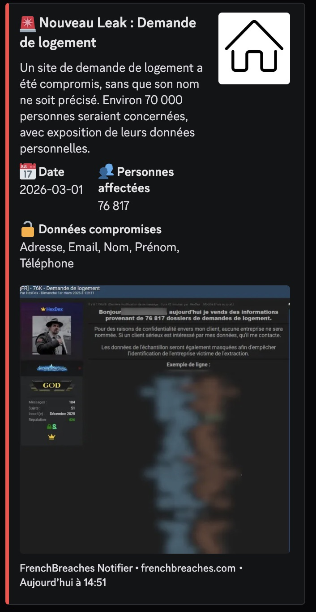
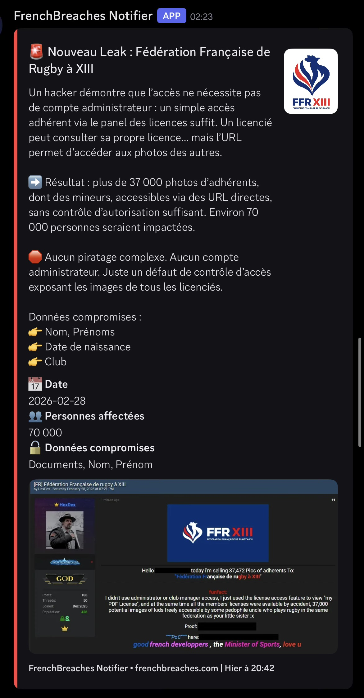

<div align="center">
  <h1>FrenchBreaches Notifier</h1>
  <p>Surveille l'API de <a href="https://frenchbreaches.com">FrenchBreaches</a> et envoie des notifications via un Webhook Discord pour chaque nouveau leak détecté.</p>
</div>

---

## ⚠️ Avertissement

Ce projet n'est pas affilié à FrenchBreaches.com. 

Il est développé à des fins éducatives et de veille personnelle uniquement. 


## Fonctionnement

1. **Premier lancement** — Enregistre tous les leaks existants sans envoyer de notification.
2. **Boucle** — Interroge l'API à intervalle régulier (`CHECK_INTERVAL`).
3. **Détection** — Compare les IDs récupérés avec ceux déjà vus (`seen_leaks.json`).
4. **Notification** — Envoie un Webhook pour chaque nouveau leak détecté.

## Stack

| Élément | Détail |
|---|---|
| **Runtime** | Python 3.13 (Alpine) |
| **Dépendances** | `requests`, `python-dotenv`, `loguru` |
| **Conteneur** | Docker + Docker Compose |

## Installation

### 1. Configurer les variables d'environnement

```bash
cp .env.example .env
```

Éditer `.env` et renseigner au minimum le **Webhook Discord** :

```env
DISCORD_WEBHOOK_URL=https://discord.com/api/webhooks/XXXX/XXXX
```

### 2. Lancement de la stack

```bash
docker compose up -d
```

Vérifier les logs :

```bash
docker compose logs -f
```

## Variables d'environnement

Les variables d'environnement sont configurées dans le fichier `.env`.

### Variables obligatoires

| Variable | Description |
|---|---|
| `DISCORD_WEBHOOK_URL` | **Requis** — URL du Webhook Discord |

### Variables personnalisables

| Variable | Description | Défaut |
|---|---|---|
| `SEEN_FILE` | Chemin du fichier de persistance | /app/data/seen_leaks.json |
| `USER_AGENT` | User-Agent pour les requêtes HTTP | Mozilla/5.0 (Macintosh; Intel Mac OS X 10_15_7) AppleWebKit/537.36 (KHTML, like Gecko) Chrome/145.0.0.0 Safari/537.36 |
| `CHECK_INTERVAL` | Intervalle entre les vérifications en secondes (Par défaut 10 minutes) | `600` |
| `DISCORD_EMBED_COLOR` | Couleur de l'embed Discord (hex) | `0xFF4444` |
| `DISCORD_DESC_LIMIT` | Limite de caractères pour la description | `4096` |
| `DISCORD_FIELD_LIMIT` | Limite de caractères pour les champs | `1024` |

## Architecture

```
FrenchBreaches_Notifier/
├── main.py 
├── Dockerfile
├── docker-compose.yml
├── requirements.txt
├── .env.example
```

## Affichage du Webhook

### Logs

```python
frenchbreaches-notifier  | ℹ️ 2026-03-01 18:53:16 | ━━━━━━━━━━━━━━━━━━━━━━━━━━━━━━━━━━━━━━━━━━━━━━━━━━
frenchbreaches-notifier  | ℹ️ 2026-03-01 18:53:16 |   FrenchBreaches Discord Notifier
frenchbreaches-notifier  | ℹ️ 2026-03-01 18:53:16 | ━━━━━━━━━━━━━━━━━━━━━━━━━━━━━━━━━━━━━━━━━━━━━━━━━━
frenchbreaches-notifier  | ℹ️ 2026-03-01 18:53:16 | Webhook   : …3p9YYzE94HnQbka4wIXx
frenchbreaches-notifier  | ℹ️ 2026-03-01 18:53:16 | Intervalle : 300s
frenchbreaches-notifier  | ℹ️ 2026-03-01 18:53:16 | ━━━━━━━━━━━━━━━━━━━━━━━━━━━━━━━━━━━━━━━━━━━━━━━━━━
frenchbreaches-notifier  | ℹ️ 2026-03-01 18:53:17 | 1 nouveau(x) leak(s) détecté(s) !
frenchbreaches-notifier  | ✅ 2026-03-01 18:53:17 | Notification envoyée : Be Atex
```

## Captures
 
